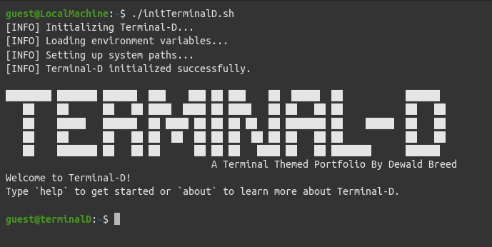

# Terminal-D

Welcome to [Terminal-D](https://terminal.dewaldbreed.co.za)!



Terminal-D is an interactive terminal-themed portfolio project. It's designed to give you a unique way to explore my work and learn more about me. Instead of a traditional portfolio, you get to use terminal commands to navigate and discover projects, skills, and contact information.

## Features

- **Interactive Terminal**: Use commands like `ls`, `cd`, `cat`, and more to navigate.
- **Customizable Themes**: Switch between preset themes or create your own.
- **Project Showcase**: Explore my projects with detailed descriptions and links.
- **Contact Information**: Easily find ways to get in touch with me.
- **User Authentication**: A proof of concept. Register and log in to save your session.

## Getting Started

To get started with Terminal-D, simply clone the repository and install the dependencies:

```sh
git clone https://github.com/yourusername/terminal-d.git
cd terminal-d
npm install
```

Then, start the development server:

```sh
npm run dev
```

Open your browser and navigate to http://localhost:3000 to start exploring Terminal-D.

## Current Commands
Here are some commands you can try:

- `ls`: List the contents of the current directory.
- `cd [directory]`: Change the current directory.
- `cat [file]`: Display the content of a file.
- `theme [name]`: Change the terminal theme.
- `login -u [email]`: Log in with your email.
- `register -u [email]`: Register a new account.
- `logout`: Log out of your current session.
- `clear`: Clear the terminal screen.

## Tech Stack

Terminal-D is built using the following technologies:

- **Frontend**:
  - React: A JavaScript library for building user interfaces.
  - TypeScript: A typed superset of JavaScript that compiles to plain JavaScript.
  - Vite: A fast build tool and development server.
  - CSS: Styling the application.

- **Backend**:
  - Node.js: A JavaScript runtime built on Chrome's V8 JavaScript engine.
  - Express: A minimal and flexible Node.js web application framework.
  - **Backend API**: For more information about the backend API, visit the [auth-api repository](https://github.com/Arc4d3-G/auth-api).

- **Database**:
  - MariaDB: An open-source relational database management system.

- **Authentication**:
  - JWT (JSON Web Tokens): For secure user authentication and session management.

- **Hosting**:
  - AWS EC2: Hosting the backend server.
  - AWS CloudFront: Hosting the frontend application with HTTPS support.

- **Other Tools**:
  - ESLint: Linting utility for JavaScript and JSX.
  - Prettier: Code formatter.

## License
This project is licensed under the MIT License.
